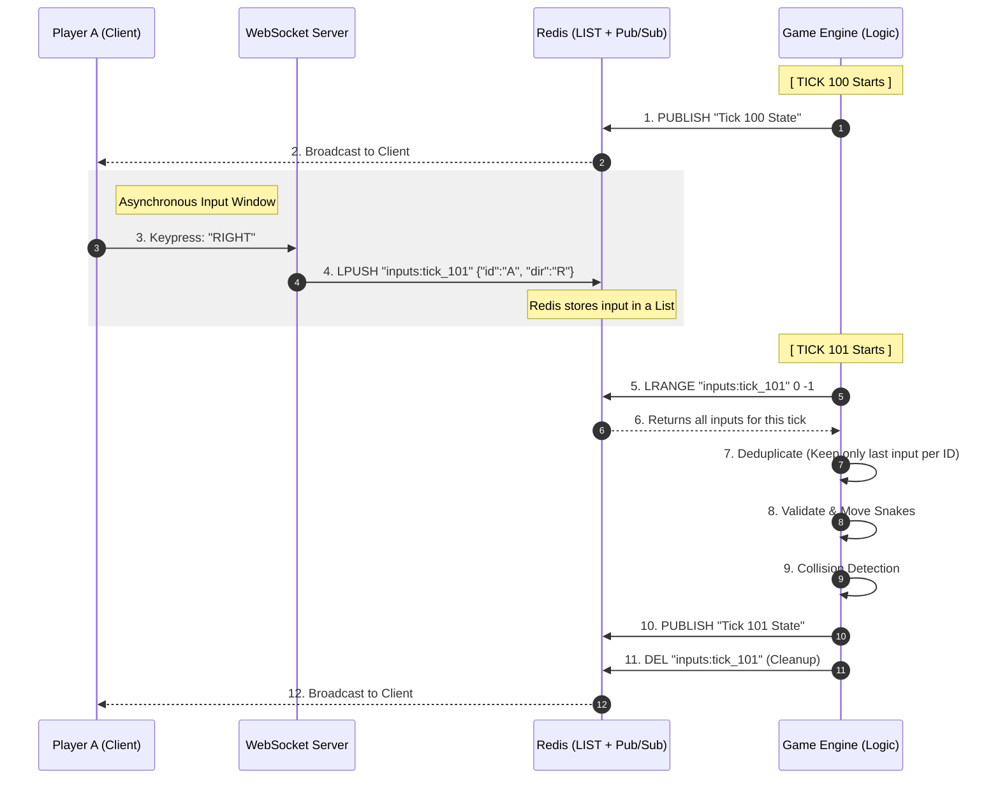

# MVP plan

## Sequence diagram

## MVP Plan

### 1. Project Structure (Monorepo)

- `packages/shared`: Pure Logic. No I/O.
- `packages/server`: The "Heartbeat" (Bun + Redis + WebSockets).
- `packages/client`: The "View" (HTML5 Canvas + Inputs).
- `packages/tests`: Integration and Logic tests (Bun Test).

### 2. Phase 1: The Functional Domain (`shared`)

- [ ] **Define Types**: `Point`, `Direction`, `Snake`, `GameState`.
- [ ] **Movement Logic**: Pure function `move(snake, direction) -> newSnake`.
- [ ] **Collision Logic**: 
    - `checkWall(snake, gridSize) -> boolean`.
    - `checkSelf(snake) -> boolean`.
- [ ] **The Reducer**: `tick(state, inputs[]) -> nextState`.
    - Handle 180-degree turn validation.
    - Resolve movement and deaths.

### 3. Phase 2: Infrastructure & Redis (`server`)

- [ ] **Input Ingestion**: 
    - WebSocket `onMessage` -> `JSON.parse` -> `LPUSH room:1:inputs {pid, dir, tick}`.
- [ ] **The Authoritative Tick (100ms)**:
    - The following commands are suggestions and need to be validated
    - `LRANGE room:1:inputs 0 -1` to fetch all pending moves.
    - Apply `shared.tick(currentState, inputs)`.
    - `PUBLISH room:1:state {snapshot}`.
    - `DEL room:1:inputs` to clear the buffer for the next tick.
- [ ] **Connection Management**: Track active `PlayerID` and handle `ws.close` (remove snake).

### 4. Phase 3: Minimal Reactive Client (`client`)

- [ ] **Canvas Renderer**: Listen to WebSocket `message` -> Clear -> Draw all snakes.
- [ ] **Input Capture**: `keydown` -> Send `{type: 'MOVE', dir: '...'}` to Server.
- [ ] **Death Feedback**: Show "GAME OVER" if the server removes the player's ID.

### 5. Success Criteria

1. Single player can move in 4 directions.
2. High-latency simulation (Redis buffering) works without stutter.
3. Hitting the canvas boundary (Wall) triggers immediate death/reset.
